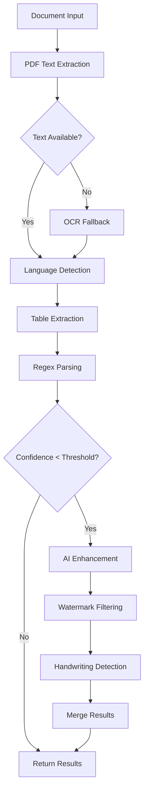

# AI Extraction Guide
**Document Sorter — AI-Enhanced Text Extraction**  
**Version:** 1.2  
**Last Updated:** 2025-01-27

---

## Table of Contents
1. [Overview](#overview)
2. [Feature Flags & Configuration](#feature-flags--configuration)
3. [AI Service Setup](#ai-service-setup)
4. [Extraction Pipeline](#extraction-pipeline)
5. [Troubleshooting](#troubleshooting)
6. [Performance Optimization](#performance-optimization)
7. [Examples & Use Cases](#examples--use-cases)
8. [Advanced Configuration](#advanced-configuration)

---

## Overview

The Document Sorter's AI extraction system provides intelligent document analysis using multiple extraction methods and AI enhancement. The system combines traditional regex parsing with advanced AI services to achieve high accuracy and reliability.

### Key Features
- **Hybrid Extraction**: Combines regex, table extraction, OCR, and AI analysis
- **Multi-language Support**: Automatic language detection and processing
- **Intelligent Fallbacks**: Graceful degradation when AI services are unavailable
- **Caching System**: Persistent caching for improved performance
- **Real-time Monitoring**: Telemetry and diagnostics for system health

### Extraction Methods
1. **Regex Parsing** (Primary) - Fast, reliable pattern matching
2. **Table Extraction** - Preserves structured data from tables
3. **OCR Fallback** - Handles image-based PDFs
4. **AI Enhancement** - Intelligent analysis and field extraction
5. **Language Detection** - Multi-language document support

---

## Feature Flags & Configuration

### Core Configuration File
The main configuration is stored in `config/default.json`:

```json
{
  "ai": {
    "enabled": false,
    "model": "gpt-3.5-turbo",
    "confidenceThreshold": 0.5,
    "batchSize": 5,
    "maxRetries": 3,
    "retryDelay": 1000,
    "timeout": 30000
  },
  "extraction": {
    "useOCR": false,
    "useTableExtraction": false,
    "useLLMEnhancer": true,
    "useHandwritingDetection": false,
    "useWatermarkDetection": false,
    "ocrLanguage": "eng",
    "ocrWorkerPoolSize": 2,
    "tableTimeout": 30000,
    "handwritingLanguage": "eng",
    "handwritingWorkerPoolSize": 1,
    "watermarkMinOccurrences": 3,
    "watermarkPageOverlapThreshold": 0.5
  }
}
```

### Feature Flags Explained

#### AI Configuration
- **`ai.enabled`**: Master switch for AI services
- **`ai.model`**: AI model to use (`gpt-3.5-turbo`, `gpt-4`, `gpt-4-turbo`)
- **`ai.confidenceThreshold`**: Minimum confidence for AI results (0.0-1.0)
- **`ai.batchSize`**: Number of documents to process in parallel
- **`ai.maxRetries`**: Maximum retry attempts for failed AI calls
- **`ai.timeout`**: Request timeout in milliseconds

#### Extraction Features
- **`useOCR`**: Enable OCR fallback for image-based PDFs
- **`useTableExtraction`**: Extract and preserve table structures
- **`useLLMEnhancer`**: Use AI to enhance extraction results
- **`useHandwritingDetection`**: Detect handwritten content
- **`useWatermarkDetection`**: Filter out watermarks from extraction

#### Performance Settings
- **`ocrWorkerPoolSize`**: Number of OCR workers (1-4 recommended)
- **`handwritingWorkerPoolSize`**: Number of handwriting detection workers
- **`tableTimeout`**: Timeout for table extraction operations
- **`watermarkMinOccurrences`**: Minimum occurrences to consider text a watermark

---

## AI Service Setup

### Prerequisites
1. **OpenAI API Key**: Required for AI services
2. **Node.js**: Version 18 or higher
3. **Memory**: Minimum 4GB RAM (8GB recommended for OCR)

### Environment Variables
Set the following environment variables:

```bash
# Required for AI services
export OPENAI_API_KEY="your-api-key-here"

# Optional: Override default settings
export AI_MODEL="gpt-4"
export AI_TIMEOUT="60000"
export NODE_ENV="production"
```

### API Key Configuration
The system automatically detects the `OPENAI_API_KEY` environment variable. For development, you can also set it in your shell profile:

```bash
# Add to ~/.bashrc or ~/.zshrc
echo 'export OPENAI_API_KEY="your-api-key-here"' >> ~/.bashrc
source ~/.bashrc
```

### Model Selection
Choose the appropriate AI model based on your needs:

| Model | Speed | Accuracy | Cost | Use Case |
|-------|-------|----------|------|----------|
| `gpt-3.5-turbo` | Fast | Good | Low | General documents |
| `gpt-4` | Medium | High | Medium | Complex documents |
| `gpt-4-turbo` | Fast | High | Medium | High-volume processing |

---

## Extraction Pipeline

### Processing Flow
The extraction pipeline follows this sequence:



### Step-by-Step Process

1. **PDF Text Extraction**
   - Uses `pdf-parse` library
   - Extracts raw text from PDF documents
   - Handles both text-based and image-based PDFs

2. **OCR Fallback** (if enabled)
   - Triggers when PDF text extraction returns empty results
   - Uses Tesseract.js for optical character recognition
   - Supports multiple languages via `ocrLanguage` setting

3. **Language Detection**
   - Automatically detects document language using `franc` library
   - Provides confidence scores for language detection
   - Used to optimize AI prompts and processing

4. **Table Extraction** (if enabled)
   - Identifies and extracts table structures
   - Preserves table formatting and relationships
   - Returns structured JSON data

5. **Regex Parsing**
   - Primary extraction method using pattern matching
   - Fast and reliable for well-formatted documents
   - Extracts client names, dates, document types, amounts

6. **AI Enhancement** (if enabled and needed)
   - Triggers when regex confidence is below threshold
   - Uses configured AI model for intelligent analysis
   - Provides enhanced field extraction and validation

7. **Post-Processing**
   - Watermark filtering removes repeated overlay text
   - Handwriting detection identifies manual annotations
   - Results merging combines all extraction methods

### Confidence Scoring
The system uses a confidence scoring system (0.0-1.0):

- **0.9-1.0**: Very High - Multiple extraction methods agree
- **0.7-0.9**: High - Strong pattern matches or AI confidence
- **0.5-0.7**: Medium - Moderate confidence, may need review
- **0.3-0.5**: Low - Weak matches, AI fallback recommended
- **0.0-0.3**: Very Low - Manual review required

---

## Troubleshooting

### Common Issues

#### 1. AI Service Not Responding
**Symptoms:**
- "AI service unavailable" errors
- Timeout errors in logs
- Fallback to regex processing

**Solutions:**
```bash
# Check API key
echo $OPENAI_API_KEY

# Test API connectivity
curl -H "Authorization: Bearer $OPENAI_API_KEY" \
     https://api.openai.com/v1/models

# Increase timeout in config
{
  "ai": {
    "timeout": 60000
  }
}
```

#### 2. Memory Issues with OCR
**Symptoms:**
- "JavaScript heap out of memory" errors
- Application crashes during OCR processing
- Slow performance with large documents

**Solutions:**
```bash
# Increase Node.js memory limit
export NODE_OPTIONS="--max-old-space-size=8192"

# Reduce OCR worker pool size
{
  "extraction": {
    "ocrWorkerPoolSize": 1
  }
}

# Process documents in smaller batches
{
  "ai": {
    "batchSize": 2
  }
}
```

#### 3. Low Extraction Accuracy
**Symptoms:**
- Incorrect client names or dates
- Missing document information
- Low confidence scores

**Solutions:**
```bash
# Enable AI enhancement
{
  "extraction": {
    "useLLMEnhancer": true
  }
}

# Lower confidence threshold
{
  "ai": {
    "confidenceThreshold": 0.3
  }
}

# Enable table extraction for structured documents
{
  "extraction": {
    "useTableExtraction": true
  }
}
```

#### 4. Cache Issues
**Symptoms:**
- Slow performance on repeated documents
- Inconsistent results
- Cache-related errors

**Solutions:**
```bash
# Clear cache
rm -rf ~/.document-sorter/cache

# Reset cache settings
{
  "cache": {
    "enabled": true,
    "maxSize": 1000,
    "maxAge": 604800000
  }
}
```

### Debug Mode
Enable debug mode for detailed logging:

```json
{
  "debug": true,
  "telemetry": {
    "enabled": true,
    "logLevel": "debug"
  }
}
```

### Log Analysis
Check logs for common error patterns:

```bash
# View recent logs
tail -f ~/.document-sorter/logs/app.log

# Search for AI errors
grep "AI" ~/.document-sorter/logs/app.log

# Check memory usage
grep "memory" ~/.document-sorter/logs/app.log
```

---

## Performance Optimization

### Memory Management
- **OCR Processing**: Use worker pools (1-2 workers recommended)
- **Batch Processing**: Limit concurrent AI requests
- **Cache Management**: Regular cache cleanup and size limits

### Speed Optimization
- **Feature Selection**: Enable only needed extraction features
- **Model Choice**: Use faster models for high-volume processing
- **Caching**: Enable caching for repeated documents

### Resource Monitoring
The system provides telemetry for monitoring:

```javascript
// Get performance metrics
const metrics = telemetryService.getMetrics();
console.log('AI Calls:', metrics.aiCalls);
console.log('Cache Hit Rate:', metrics.cacheHitRate);
console.log('Average Processing Time:', metrics.avgProcessingTime);
```

### Recommended Settings by Use Case

#### High-Volume Processing
```json
{
  "ai": {
    "model": "gpt-3.5-turbo",
    "batchSize": 10,
    "timeout": 30000
  },
  "extraction": {
    "useOCR": false,
    "useTableExtraction": true,
    "useLLMEnhancer": true
  }
}
```

#### High-Accuracy Processing
```json
{
  "ai": {
    "model": "gpt-4",
    "confidenceThreshold": 0.7,
    "batchSize": 3
  },
  "extraction": {
    "useOCR": true,
    "useTableExtraction": true,
    "useLLMEnhancer": true,
    "useHandwritingDetection": true
  }
}
```

#### Mixed Document Types
```json
{
  "ai": {
    "model": "gpt-4-turbo",
    "confidenceThreshold": 0.5
  },
  "extraction": {
    "useOCR": true,
    "useTableExtraction": true,
    "useLLMEnhancer": true,
    "useWatermarkDetection": true
  }
}
```

---

## Examples & Use Cases

### Example 1: Invoice Processing
**Input Document**: PDF invoice with client name, date, amount
**Configuration**:
```json
{
  "extraction": {
    "useTableExtraction": true,
    "useLLMEnhancer": true
  }
}
```
**Expected Output**:
```json
{
  "clientName": "Acme Corporation",
  "date": "2024-01-15",
  "type": "Invoice",
  "amount": "$1,500.00",
  "confidence": 0.95,
  "source": "ai+regex"
}
```

### Example 2: Multilingual Contract
**Input Document**: Contract in Spanish with signatures
**Configuration**:
```json
{
  "extraction": {
    "useLLMEnhancer": true,
    "useHandwritingDetection": true,
    "ocrLanguage": "spa"
  }
}
```
**Expected Output**:
```json
{
  "clientName": "Corporación Ejemplo",
  "date": "2024-01-15",
  "type": "Contract",
  "language": "spa",
  "hasSignature": true,
  "confidence": 0.88,
  "source": "ai"
}
```

### Example 3: Scanned Document
**Input Document**: Scanned PDF with no extractable text
**Configuration**:
```json
{
  "extraction": {
    "useOCR": true,
    "useLLMEnhancer": true,
    "ocrLanguage": "eng"
  }
}
```
**Expected Output**:
```json
{
  "clientName": "Scanned Client Inc",
  "date": "2024-01-15",
  "type": "Report",
  "confidence": 0.82,
  "source": "ocr+ai"
}
```

---

## Advanced Configuration

### Custom AI Prompts
Modify AI prompts in `src/services/ai_prompts.js`:

```javascript
function buildSystemPrompt(model, includeExamples = true, detectedLanguage = null) {
  let prompt = `You are an expert document analysis assistant...`;
  
  if (detectedLanguage && detectedLanguage !== 'eng') {
    prompt += `\n\nThis document appears to be in ${detectedLanguage}. `;
    prompt += `Please analyze it accordingly and respond in English.`;
  }
  
  return prompt;
}
```

### Custom Extraction Patterns
Add custom regex patterns in `src/services/parsingService.js`:

```javascript
const customPatterns = {
  clientName: [
    /(?:client|customer|bill to):\s*([^\n\r]+)/i,
    /(?:company|organization):\s*([^\n\r]+)/i
  ],
  date: [
    /(?:date|issued|created):\s*(\d{1,2}[\/\-]\d{1,2}[\/\-]\d{2,4})/i,
    /(\d{4}-\d{2}-\d{2})/
  ]
};
```

### Telemetry Customization
Configure telemetry in `src/services/telemetryService.js`:

```javascript
const telemetryConfig = {
  enabled: true,
  logLevel: 'info',
  trackAICalls: true,
  trackCacheStats: true,
  trackPerformance: true,
  retentionDays: 30
};
```

### Error Handling
Customize error handling in service files:

```javascript
try {
  const result = await aiService.processDocument(text);
  return result;
} catch (error) {
  console.error('AI processing failed:', error);
  
  // Log to telemetry
  if (this.telemetry) {
    this.telemetry.trackError('ai_processing_failed', error.message, {
      documentType: 'pdf',
      processingTime: Date.now() - startTime
    });
  }
  
  // Fallback to regex
  return this.fallbackToRegex(text);
}
```

---

## Support & Maintenance

### Regular Maintenance Tasks
1. **Cache Cleanup**: Clear cache weekly to prevent memory issues
2. **Log Rotation**: Monitor log file sizes and rotate as needed
3. **Performance Monitoring**: Check telemetry metrics regularly
4. **Model Updates**: Update AI models when new versions are available

### Monitoring Commands
```bash
# Check system health
npm run health-check

# View telemetry dashboard
npm run telemetry-dashboard

# Clear cache
npm run clear-cache

# Run diagnostics
npm run diagnostics
```

### Getting Help
- **Logs**: Check `~/.document-sorter/logs/` for detailed error information
- **Telemetry**: Use the built-in telemetry dashboard for performance insights
- **Configuration**: Verify all settings in `config/default.json`
- **API Status**: Check OpenAI API status at https://status.openai.com

---

*This guide covers the essential aspects of the AI extraction system. For additional support or feature requests, please refer to the project documentation or contact the development team.*
